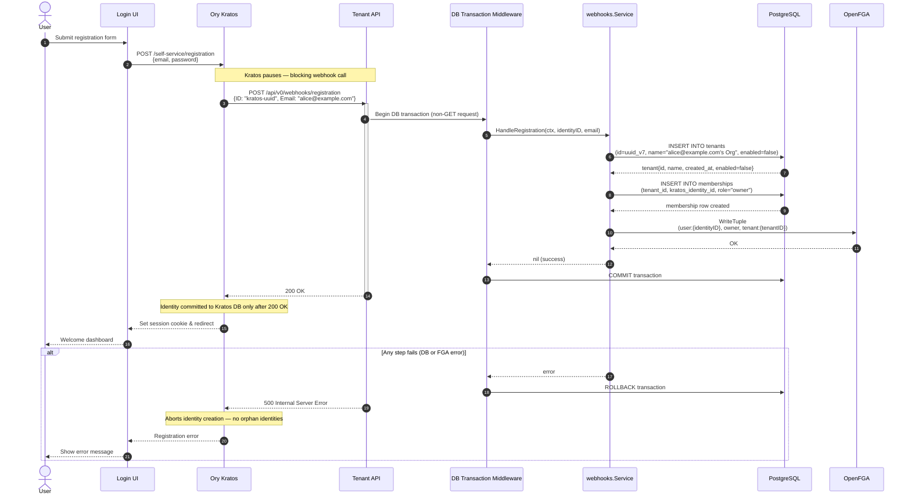
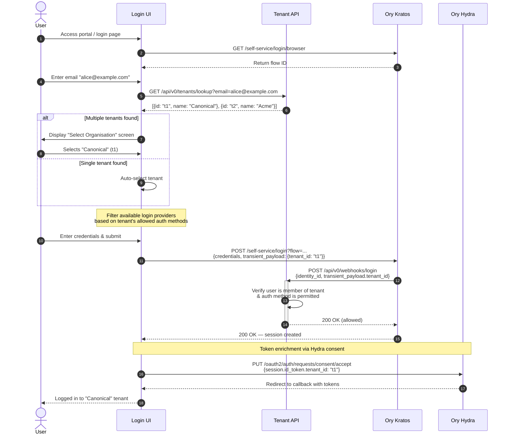
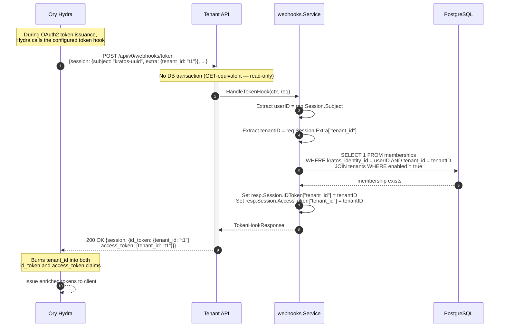
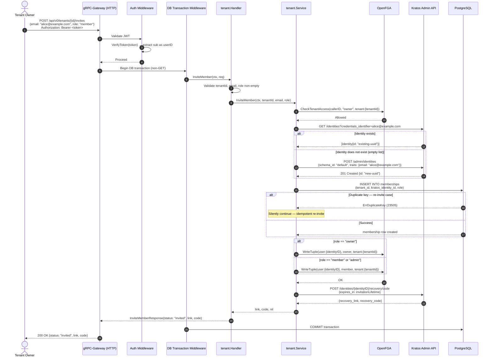
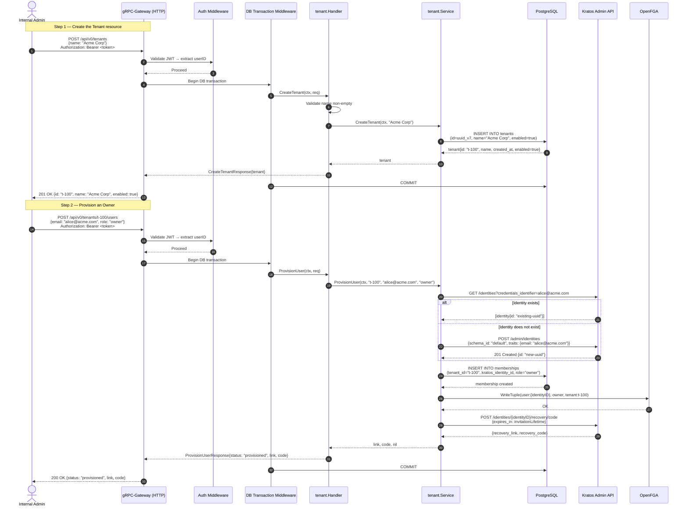
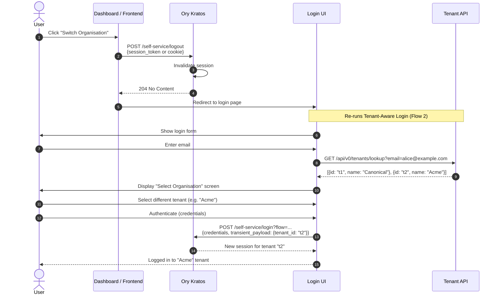

# Sequence Diagrams — Tenant Service User Flows

This document describes the end-to-end user flows for the Tenant Service, as defined in
`ID054 — Tenant API`.

> **Legend**
> - Diagrams represent the **intended end state** of each flow.
> - Implementation gaps relative to the current codebase are tracked in the [Gap Summary](#implementation-gap-summary) below and in [TODO.md](../TODO.md).

---

## Flow 1 — Self-Service Registration

A new user registers via the Login UI. Kratos pauses identity creation and calls the Tenant API
webhook. The Tenant API atomically creates a disabled "shadow tenant" and assigns the user as
owner in both PostgreSQL and OpenFGA. Only on `200 OK` does Kratos commit the identity — ensuring
no orphaned identities are ever created.

**Systems:** Login UI → Kratos → Tenant API → PostgreSQL → OpenFGA

---

## Flow 2 — Tenant-Aware Login

A user visits the portal, enters their email, and the Login UI discovers which tenants they belong
to. If they belong to multiple tenants they select one. The selected `tenant_id` is injected into
the Kratos login payload. Kratos fires a login validation webhook to the Tenant API which approves
or rejects the auth method for that tenant.

**Systems:** Login UI → Tenant API (lookup) → Kratos → Tenant API (login webhook)

> See [issue #15](https://github.com/canonical/tenant-service/issues/15) for implementation status.

---

## Flow 3 — Token Enrichment (Hydra Token Hook)

After a successful Kratos login, Hydra calls the Tenant API token hook during OAuth2 token
issuance. The session already carries the `tenant_id` selected by the user during the login flow
(injected at the consent step in Flow 2). The hook validates that the user is still an active
member of that tenant and burns the single `tenant_id` into both the `id_token` and
`access_token` claims.

**Systems:** Hydra → Tenant API → PostgreSQL → Hydra (enriched tokens)

---

## Flow 4 — User Invitation

A Tenant Owner invites an additional user to their tenant. The caller must already hold the
`owner` relation on the tenant in OpenFGA — this flow cannot be used to assign the *first* owner
(see Flow 5 for that). The Tenant API finds or creates the invitee's Kratos identity, creates a
membership, writes the FGA tuple, and returns a Kratos recovery link + code as the invitation.
Re-inviting an existing member is safe and idempotent.

**Caller:** Tenant Owner (public internet, JWT-authenticated)
**Systems:** Tenant Owner → Tenant API → OpenFGA → Kratos Admin → PostgreSQL

> See [issue #11](https://github.com/canonical/tenant-service/issues/11) for implementation status.

---

## Flow 5 — Enterprise Onboarding (2-step Admin)

An internal admin bootstraps a new enterprise tenant. This is a **one-time setup flow**: it
solves the bootstrap problem where no owner exists yet and therefore nobody can call
`InviteMember` (Flow 4). Once `ProvisionUser` has assigned the first owner, all subsequent
membership changes should go through `InviteMember`. `ProvisionUser` is restricted to the
internal network and does not require the caller to hold any per-tenant relation in OpenFGA.

**Caller:** Internal Admin (internal network only)
**Systems:** Admin → Tenant API → PostgreSQL → Kratos Admin → OpenFGA

> See [TODO.md](../TODO.md) for implementation status.

### Invite vs Provision — when to use which

Both flows share the same core mechanics (find-or-create Kratos identity, insert membership, write
FGA tuple, generate recovery link). The difference is **who can call them** and **when**:

| | Flow 4 — Invite Member | Flow 5 — Provision User |
|---|---|---|
| **Caller** | Tenant Owner (public internet) | Internal Admin (internal network only) |
| **Pre-condition** | Tenant must already have an owner | No ownership pre-condition — this *creates* the owner |
| **Authorisation** | OpenFGA ownership check required | Network boundary enforces access; no per-tenant check |
| **Idempotency** | Safe — duplicate membership silently ignored | Not safe — fails on duplicate key |
| **Use case** | Growing an existing team | One-time bootstrap of a new enterprise tenant |

> **Implementation note:** the shared logic (find-or-create identity, add membership, assign FGA
> role, generate recovery link) should be extracted into a single private service method to prevent
> the two flows from drifting apart. Currently `ProvisionUser` is missing the recovery link step
> that `InviteMember` already has.

---

## Flow 6 — Tenant Switching

A logged-in user switches to a different tenant. Kratos logs them out and they go through the
Tenant-Aware Login flow (Flow 2) again, this time selecting the other tenant.

**Systems:** User → Kratos (logout) → Login UI → (re-runs Flow 2)

> Requires Flow 2 (Tenant-Aware Login) to be complete. See [issue #15](https://github.com/canonical/tenant-service/issues/15).

---

## Implementation Gap Summary

| Gap | Affects Flow | GitHub Issue |
|---|---|---|
| `GET /api/v0/tenants/lookup?email=...` — tenant discovery endpoint | Flow 2, Flow 6 | [#15](https://github.com/canonical/tenant-service/issues/15) |
| `POST /api/v0/webhooks/login` — login validation webhook | Flow 2, Flow 6 | [#15](https://github.com/canonical/tenant-service/issues/15) |
| Token hook injects single `tenant_id` (not a list) — reads from session, validates membership | Flow 3 | — |
| `CheckTenantAccess` before every write operation | Flow 4, Flow 5 | [#11](https://github.com/canonical/tenant-service/issues/11) |
| `InviteMember`: verify caller owns the tenant via OpenFGA | Flow 4 | [#11](https://github.com/canonical/tenant-service/issues/11) |
| `ProvisionUser`: call `CreateRecoveryLink` to email provisioned user | Flow 5 | [TODO.md](../TODO.md) |
