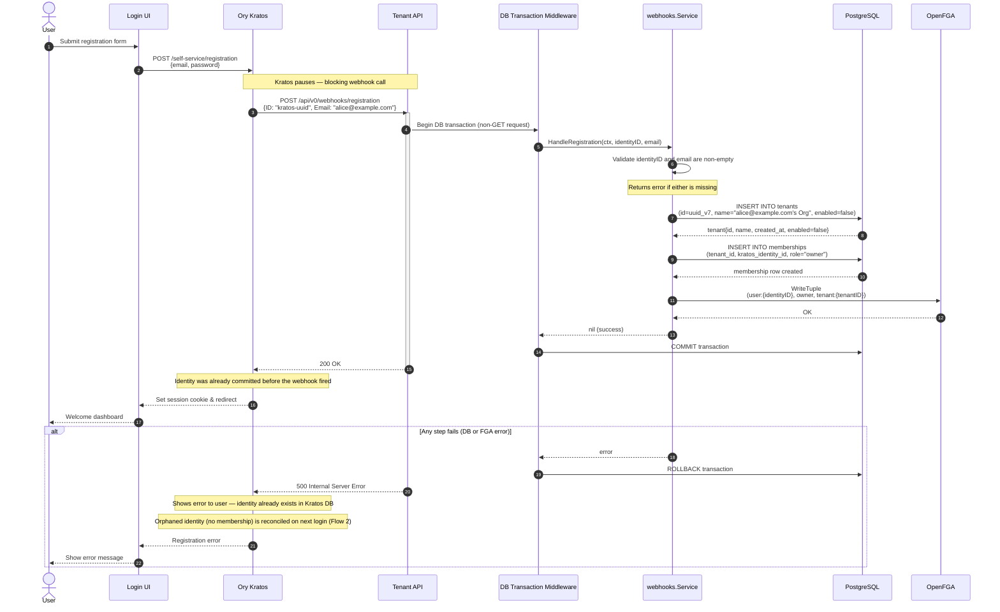
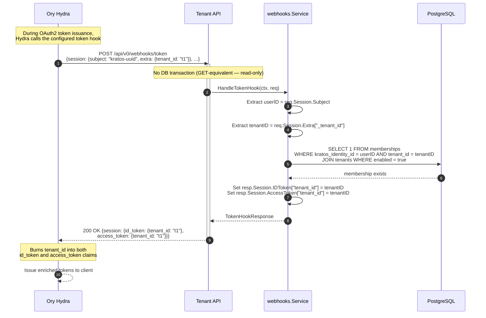
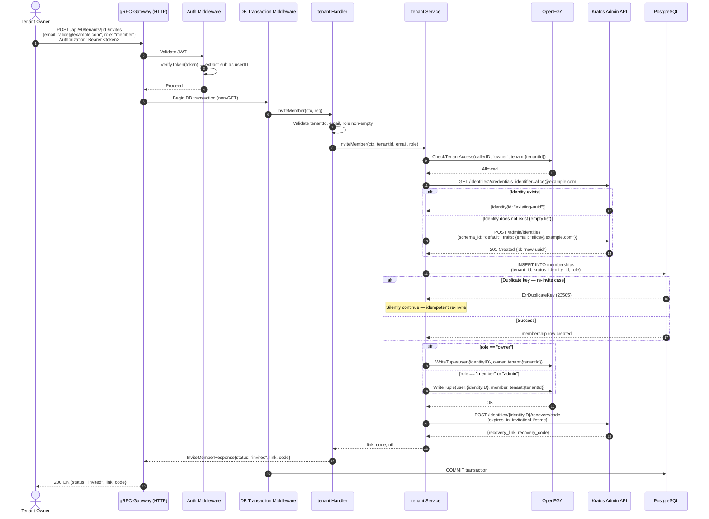
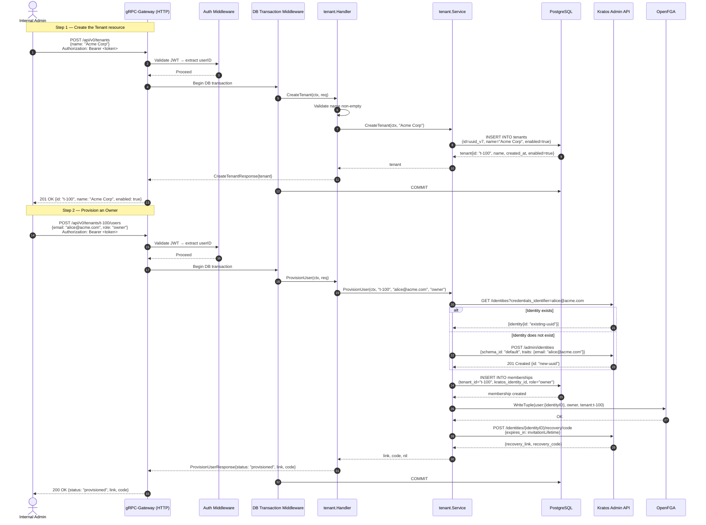
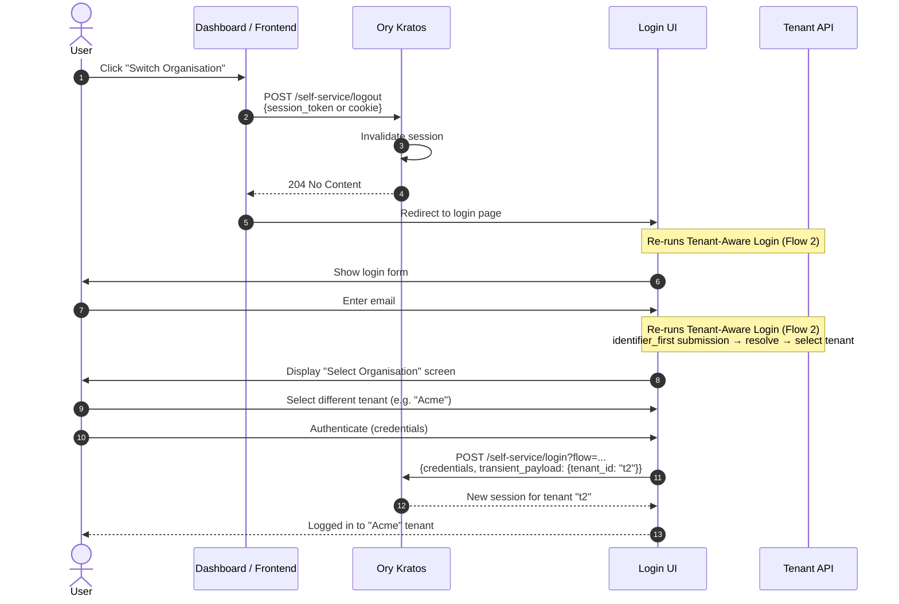

# Sequence Diagrams — Tenant Service User Flows

This document describes the end-to-end user flows for the Tenant Service, as defined in
`ID054 — Tenant API`.

> **Legend**
> - Diagrams represent the **intended end state** of each flow.
> - Implementation gaps relative to the current codebase are tracked in the [Gap Summary](#implementation-gap-summary) below and in [TODO.md](../TODO.md).

---

## Flow 1 — Self-Service Registration

A new user registers via the Login UI. Kratos fires the Tenant API webhook **after** the identity
has already been persisted. The Tenant API creates a disabled "shadow tenant" and assigns the user
as owner in both PostgreSQL and OpenFGA. If the webhook fails, the Kratos identity still exists but
has no membership — an "orphaned identity". These are automatically remediated by the login hook
(Flow 2) via lazy reconciliation. See [ADR 0008](adr/0008-tenant-aware-login.md).

**Systems:** Login UI → Kratos → Tenant API → PostgreSQL → OpenFGA

```mermaid
sequenceDiagram
    autonumber
    actor User
    participant UI as Login UI
    participant Kratos as Ory Kratos
    participant TenantAPI as Tenant API
    participant MW as DB Transaction Middleware
    participant WebhookSvc as webhooks.Service
    participant DB as PostgreSQL
    participant FGA as OpenFGA

    User->>UI: Submit registration form
    UI->>Kratos: POST /self-service/registration<br/>{email, password}

    Note over Kratos,TenantAPI: Kratos pauses — blocking webhook call
    Kratos->>TenantAPI: POST /api/v0/webhooks/registration<br/>{ID: "kratos-uuid", Email: "alice@example.com"}

    activate TenantAPI
    TenantAPI->>MW: Begin DB transaction (non-GET request)
    MW->>WebhookSvc: HandleRegistration(ctx, identityID, email)

    WebhookSvc->>WebhookSvc: Validate identityID and email are non-empty
    Note over WebhookSvc: Returns error if either is missing

    WebhookSvc->>DB: INSERT INTO tenants<br/>(id=uuid_v7, name="alice@example.com's Org", enabled=false)
    DB-->>WebhookSvc: tenant{id, name, created_at, enabled=false}

    WebhookSvc->>DB: INSERT INTO memberships<br/>(tenant_id, kratos_identity_id, role="owner")
    DB-->>WebhookSvc: membership row created

    WebhookSvc->>FGA: WriteTuple<br/>(user:{identityID}, owner, tenant:{tenantID})
    FGA-->>WebhookSvc: OK

    WebhookSvc-->>MW: nil (success)
    MW->>DB: COMMIT transaction
    TenantAPI-->>Kratos: 200 OK
    deactivate TenantAPI

    Note over Kratos: Identity was already committed before the webhook fired
    Kratos-->>UI: Set session cookie & redirect
    UI-->>User: Welcome dashboard

    alt Any step fails (DB or FGA error)
        WebhookSvc-->>MW: error
        MW->>DB: ROLLBACK transaction
        TenantAPI-->>Kratos: 500 Internal Server Error
        Note over Kratos: Shows error to user — identity already exists in Kratos DB
        Note over Kratos: Orphaned identity (no membership) is reconciled on next login (Flow 2)
        Kratos-->>UI: Registration error
        UI-->>User: Show error message
    end
```

---

## Flow 2 — Tenant-Aware Login

A user visits the portal and starts an OAuth2 authorization-code flow. The Login UI Go backend's
`handleCreateFlow` endpoint manages the entire decision through the **InterceptLogin** plugin
pattern. The `TenantResolverInterface` plugin encapsulates all tenant-specific logic, keeping the
handler itself multi-tenancy-agnostic.

When the user has an active Kratos session, `InterceptLogin` evaluates three possible outcomes:
- **DeferMFAChecks**: The user has a session but hasn't authenticated for this specific login
  challenge yet (cookie has no matching `LoginChallengeHash`). MFA/WebAuthn enforcement is
  deferred until after the user completes first-factor auth.
- **SelectTenant**: The user is authenticated but needs to choose a tenant (2+ tenants found,
  none stored in cookie yet). The backend redirects to `/ui/select_tenant`.
- **AcceptLogin**: The tenant has been resolved (single tenant auto-selected, or user previously
  chose one). The backend accepts the Hydra login immediately.

When multi-tenancy is **disabled**, the `NoOpTenantResolver` returns all-zero fields (no special
handling), and the handler falls through to its standard `MustReAuthenticate` logic unchanged.

After the identifier-first step (email entry), the backend checks `NeedsTenantSelectionByEmail`
to determine if the user needs to pick a tenant — this happens **before** the password form is
shown. If the user belongs to 2+ active tenants, the backend redirects to `/ui/select_tenant`;
single-tenant users are automatically redirected through the selection page (which auto-submits);
zero-tenant users proceed immediately with a `__none__` sentinel. Only after tenant resolution
is complete does the password form appear.

Finally, during the consent step, the Go backend reads the `TenantID` from the encrypted state
cookie and passes it to Hydra as `_tenant_id` in the consent accept payload.

**Systems:** Login UI (Go) → Tenant API → Kratos → Hydra

```mermaid
sequenceDiagram
    autonumber
    actor User
    participant Frontend as Login UI (Next.js)
    participant Backend as Login UI (Go)
    participant Plugin as TenantResolver Plugin
    participant TenantAPI as Tenant API
    participant Kratos as Ory Kratos
    participant Hydra as Ory Hydra

    User->>Frontend: Click "Authorize" (starts OAuth2 flow)
    Frontend->>Backend: GET /api/kratos/self-service/login/browser<br/>?login_challenge=abc123

    alt No active Kratos session
        Note over Backend: session == nil → skip InterceptLogin entirely
        Backend->>Kratos: Create new login flow (refresh=true)
        Kratos-->>Backend: LoginFlow{id: "flow-id"}
        Backend-->>Frontend: {flow_id: "...", redirect_to: "/ui/login?flow=..."}
        Frontend->>User: Show identifier-first login form

        User->>Frontend: Enter email
        Frontend->>Backend: POST /api/kratos/self-service/login/id-first
        Backend->>Kratos: Submit identifier_first
        Kratos-->>Backend: Flow advanced to password step

        Note over Backend,Plugin: NeedsTenantSelectionByEmail — tenant check BEFORE password
        Backend->>Plugin: NeedsTenantSelectionByEmail(ctx, email, cookie, loginChallenge)
        Plugin->>TenantAPI: GET /api/v0/tenants/lookup?email=alice@example.com

        alt 0 tenants
            TenantAPI-->>Plugin: {"tenants": []}
            Plugin-->>Backend: needsSelection=false, cookie.TenantID="__none__"
            Backend-->>Frontend: {redirect_to: "/ui/login?flow=..."} (password form)
        else 1 tenant
            TenantAPI-->>Plugin: {"tenants": [{id: "t1"}]}
            Plugin-->>Backend: needsSelection=true
            Backend-->>Frontend: {redirect_to: "/ui/select_tenant?flow=...&login_challenge=..."}
            Frontend->>Frontend: Tenant page auto-selects single tenant
            Frontend-->>Frontend: Redirect back to /ui/login?flow=... (password form)
        else 2+ tenants
            TenantAPI-->>Plugin: {"tenants": [{id: "t1"}, {id: "t2"}]}
            Plugin-->>Backend: needsSelection=true
            Backend-->>Frontend: {redirect_to: "/ui/select_tenant?flow=...&login_challenge=..."}
            Frontend->>User: Display "Select a tenant" screen
            User->>Frontend: Selects "Canonical" (t1)
            Frontend->>Backend: POST /api/v0/auth/tenant<br/>{login_challenge: "abc123", tenant_id: "t1", flow: "flow-id"}
            Backend->>Backend: Store t1 in cookie
            Backend-->>Frontend: {redirect_to: "/ui/login?flow=..."} (password form)
        end

        Frontend->>User: Show password form
        User->>Frontend: Enter password & submit
        Frontend->>Kratos: POST /self-service/login?flow=...
        Kratos-->>Frontend: Session created

        Frontend->>Backend: GET /api/kratos/self-service/login/browser<br/>?login_challenge=abc123
    end

    Note over Backend,Plugin: User now has a Kratos session → handleCreateFlow calls InterceptLogin
    Backend->>Plugin: InterceptLogin(ctx, session, cookie, loginChallenge)

    alt Cookie has no matching LoginChallengeHash (first visit for this challenge)
        Plugin-->>Backend: {DeferMFAChecks: true}
        Note over Backend: Skip MFA/WebAuthn checks
        Backend->>Plugin: (falls through to NeedsTenantSelection via handleUpdateFlow)

        Plugin->>TenantAPI: GET /api/v0/tenants/lookup?identity_id={session.Identity.Id}

        alt 0 tenants
            TenantAPI-->>Plugin: {"tenants": []}
            Plugin-->>Backend: Set cookie.TenantID = "__none__"
            Backend->>Hydra: PUT /oauth2/auth/requests/login/accept
            Hydra-->>Backend: Redirect to consent
        else 1 tenant
            TenantAPI-->>Plugin: {"tenants": [{id: "t1"}]}
            Plugin-->>Backend: Auto-store t1 in cookie
            Backend->>Hydra: PUT /oauth2/auth/requests/login/accept
            Hydra-->>Backend: Redirect to consent
        else 2+ tenants
            TenantAPI-->>Plugin: {"tenants": [{id: "t1"}, {id: "t2"}]}
            Plugin-->>Backend: {SelectTenant: true}
            Backend-->>Frontend: Redirect to /ui/select_tenant?flow=...&login_challenge=...
            Frontend->>User: Display "Select a tenant" screen
            User->>Frontend: Selects "Canonical" (t1)
            Frontend->>Backend: POST /api/v0/auth/tenant<br/>{login_challenge: "abc123", tenant_id: "t1"}
            Backend->>Backend: Store t1 in cookie<br/>(keyed by LoginChallengeHash)
            Backend-->>Frontend: {redirect_to: "/ui/login?flow=..."}
            Frontend->>Backend: GET /api/kratos/self-service/login/browser<br/>?login_challenge=abc123
            Backend->>Plugin: InterceptLogin (cookie now has t1)
            Plugin-->>Backend: {AcceptLogin: true, Cookie: updated}
            Backend->>Hydra: PUT /oauth2/auth/requests/login/accept
        end

    else Cookie has matching LoginChallengeHash + TenantID already resolved
        Plugin-->>Backend: {AcceptLogin: true, Cookie: updated}
        Note over Backend: MFA/WebAuthn already passed
        Backend->>Hydra: PUT /oauth2/auth/requests/login/accept
        Hydra-->>Backend: Redirect to consent

    else Cookie has matching hash but no TenantID (needs selection)
        Plugin->>TenantAPI: GET /api/v0/tenants/lookup?identity_id={session.Identity.Id}
        TenantAPI-->>Plugin: 2+ tenants
        Plugin-->>Backend: {SelectTenant: true}
        Backend-->>Frontend: Redirect to /ui/select_tenant
    end

    Note over Backend,Hydra: Consent step — _tenant_id injected
    Frontend->>Backend: Consent route
    Backend->>Backend: Read TenantID from state cookie
    Backend->>Hydra: PUT /oauth2/auth/requests/consent/accept<br/>{ session: { access_token: { "_tenant_id": "t1" } } }
    Hydra-->>Backend: Redirect to callback

    Note over Hydra,TenantAPI: Token Hook (Final Arbiter)
    Hydra->>TenantAPI: POST /api/v0/webhooks/token
    activate TenantAPI
    TenantAPI->>TenantAPI: Verify active membership for _tenant_id
    TenantAPI-->>Hydra: 200 OK {session: {id_token: {tenant_id: "t1"},<br/>access_token: {tenant_id: "t1"}}}
    deactivate TenantAPI

    Backend-->>Frontend: Redirect to callback
    Frontend-->>User: Logged in with tenant_id in tokens
```

### InterceptLogin Plugin Decision Table

| Session? | Cookie matches challenge? | TenantID in cookie? | Plugin returns | Handler action |
|----------|--------------------------|---------------------|----------------|----------------|
| No       | —                        | —                   | (not called)   | Create new login flow |
| Yes      | No                       | —                   | `DeferMFAChecks` | Skip MFA, fall through to `MustReAuthenticate` |
| Yes      | Yes                      | Yes                 | `AcceptLogin`  | Accept Hydra login immediately |
| Yes      | Yes                      | No (0 tenants)      | `AcceptLogin`  | Auto-set `__none__`, accept |
| Yes      | Yes                      | No (1 tenant)       | `AcceptLogin`  | Auto-store tenant, accept |
| Yes      | Yes                      | No (2+ tenants)     | `SelectTenant` | Redirect to selection page |

### max_age=0 Interaction

When the OAuth2 authorize request includes `max_age=0`, Hydra's login challenge signals
that re-authentication is required. The `MustReAuthenticate` check on the Go backend
detects this and creates a new login flow with `refresh=true`, forcing the user to enter
credentials again regardless of their existing session. With multi-tenancy **enabled**,
the InterceptLogin plugin returns `DeferMFAChecks` for the fresh challenge (no matching
`LoginChallengeHash` yet), so MFA is only enforced after the user re-authenticates.
After re-authentication, the full tenant resolution pipeline runs again — the user must
re-select their tenant for a fresh challenge.

---

## Flow 3 — Token Enrichment (Hydra Token Hook)

After a successful Kratos login, Hydra calls the Tenant API token hook during OAuth2 token
issuance. The session already carries the `tenant_id` selected by the user during the login flow
(injected at the consent step in Flow 2). The hook validates that the user is still an active
member of that tenant and burns the single `tenant_id` into both the `id_token` and
`access_token` claims.

**Systems:** Hydra → Tenant API → PostgreSQL → Hydra (enriched tokens)

```mermaid
sequenceDiagram
    autonumber
    participant Hydra as Ory Hydra
    participant TenantAPI as Tenant API
    participant WebhookSvc as webhooks.Service
    participant DB as PostgreSQL

    Note over Hydra: During OAuth2 token issuance,<br/>Hydra calls the configured token hook

    Hydra->>TenantAPI: POST /api/v0/webhooks/token<br/>{session: {subject: "kratos-uuid", extra: {tenant_id: "t1"}}, ...}

    activate TenantAPI
    Note over TenantAPI: No DB transaction (GET-equivalent — read-only)
    TenantAPI->>WebhookSvc: HandleTokenHook(ctx, req)

    WebhookSvc->>WebhookSvc: Extract userID = req.Session.Subject
    WebhookSvc->>WebhookSvc: Extract tenantID = req.Session.Extra["_tenant_id"]

    WebhookSvc->>DB: SELECT 1 FROM memberships<br/>WHERE kratos_identity_id = userID AND tenant_id = tenantID<br/>JOIN tenants WHERE enabled = true
    DB-->>WebhookSvc: membership exists

    WebhookSvc->>WebhookSvc: Set resp.Session.IDToken["tenant_id"] = tenantID<br/>Set resp.Session.AccessToken["tenant_id"] = tenantID

    WebhookSvc-->>TenantAPI: TokenHookResponse
    TenantAPI-->>Hydra: 200 OK {session: {id_token: {tenant_id: "t1"},<br/>access_token: {tenant_id: "t1"}}}
    deactivate TenantAPI

    Note over Hydra: Burns tenant_id into both<br/>id_token and access_token claims
    Hydra-->>Hydra: Issue enriched tokens to client
```

---

## Flow 4 — User Invitation

A Tenant Owner invites an additional user to their tenant. The caller must already hold the
`owner` relation on the tenant in OpenFGA — this flow cannot be used to assign the *first* owner
(see Flow 5 for that). The Tenant API finds or creates the invitee's Kratos identity, creates a
membership, writes the FGA tuple, and returns a Kratos recovery link + code as the invitation.
Re-inviting an existing member is safe and idempotent.

**Caller:** Tenant Owner (public internet, JWT-authenticated)
**Systems:** Tenant Owner → Tenant API → OpenFGA → Kratos Admin → PostgreSQL

> See [issue #11](https://github.com/canonical/tenant-service/issues/11) for implementation status.

```mermaid
sequenceDiagram
    autonumber
    actor Owner as Tenant Owner
    participant GW as gRPC-Gateway (HTTP)
    participant AuthMW as Auth Middleware
    participant MW as DB Transaction Middleware
    participant Handler as tenant.Handler
    participant Svc as tenant.Service
    participant FGA as OpenFGA
    participant KratosAdmin as Kratos Admin API
    participant DB as PostgreSQL

    Owner->>GW: POST /api/v0/tenants/{id}/invites<br/>{email: "alice@example.com", role: "member"}<br/>Authorization: Bearer <token>

    GW->>AuthMW: Validate JWT
    AuthMW->>AuthMW: VerifyToken(token) → extract sub as userID
    AuthMW-->>GW: Proceed

    GW->>MW: Begin DB transaction (non-GET)

    MW->>Handler: InviteMember(ctx, req)
    Handler->>Handler: Validate tenantId, email, role non-empty
    Handler->>Svc: InviteMember(ctx, tenantId, email, role)

    Svc->>FGA: CheckTenantAccess(callerID, "owner", tenant:{tenantId})
    FGA-->>Svc: Allowed

    Svc->>KratosAdmin: GET /identities?credentials_identifier=alice@example.com
    alt Identity exists
        KratosAdmin-->>Svc: [identity{id: "existing-uuid"}]
    else Identity does not exist (empty list)
        Svc->>KratosAdmin: POST /admin/identities<br/>{schema_id: "default", traits: {email: "alice@example.com"}}
        KratosAdmin-->>Svc: 201 Created {id: "new-uuid"}
    end

    Svc->>DB: INSERT INTO memberships<br/>(tenant_id, kratos_identity_id, role)
    alt Duplicate key — re-invite case
        DB-->>Svc: ErrDuplicateKey (23505)
        Note over Svc: Silently continue — idempotent re-invite
    else Success
        DB-->>Svc: membership row created
    end

    alt role == "owner"
        Svc->>FGA: WriteTuple(user:{identityID}, owner, tenant:{tenantId})
    else role == "member" or "admin"
        Svc->>FGA: WriteTuple(user:{identityID}, member, tenant:{tenantId})
    end
    FGA-->>Svc: OK

    Svc->>KratosAdmin: POST /identities/{identityID}/recovery/code<br/>{expires_in: invitationLifetime}
    KratosAdmin-->>Svc: {recovery_link, recovery_code}

    Svc-->>Handler: link, code, nil
    Handler-->>GW: InviteMemberResponse{status: "invited", link, code}
    MW->>DB: COMMIT transaction
    GW-->>Owner: 200 OK {status: "invited", link, code}
```

---

## Flow 5 — Enterprise Onboarding (2-step Admin)

An internal admin bootstraps a new enterprise tenant. This is a **one-time setup flow**: it
solves the bootstrap problem where no owner exists yet and therefore nobody can call
`InviteMember` (Flow 4). Once `ProvisionUser` has assigned the first owner, all subsequent
membership changes should go through `InviteMember`. `ProvisionUser` is restricted to the
internal network and does not require the caller to hold any per-tenant relation in OpenFGA.

**Caller:** Internal Admin (internal network only)
**Systems:** Admin → Tenant API → PostgreSQL → Kratos Admin → OpenFGA

> See [TODO.md](../TODO.md) for implementation status.

```mermaid
sequenceDiagram
    autonumber
    actor Admin as Internal Admin
    participant GW as gRPC-Gateway (HTTP)
    participant AuthMW as Auth Middleware
    participant MW as DB Transaction Middleware
    participant Handler as tenant.Handler
    participant Svc as tenant.Service
    participant DB as PostgreSQL
    participant KratosAdmin as Kratos Admin API
    participant FGA as OpenFGA

    Note over Admin,GW: Step 1 — Create the Tenant resource

    Admin->>GW: POST /api/v0/tenants<br/>{name: "Acme Corp"}<br/>Authorization: Bearer <token>
    GW->>AuthMW: Validate JWT → extract userID
    AuthMW-->>GW: Proceed
    GW->>MW: Begin DB transaction

    MW->>Handler: CreateTenant(ctx, req)
    Handler->>Handler: Validate name non-empty
    Handler->>Svc: CreateTenant(ctx, "Acme Corp")
    Svc->>DB: INSERT INTO tenants<br/>(id=uuid_v7, name="Acme Corp", enabled=true)
    DB-->>Svc: tenant{id: "t-100", name, created_at, enabled=true}
    Svc-->>Handler: tenant
    Handler-->>GW: CreateTenantResponse{tenant}
    MW->>DB: COMMIT
    GW-->>Admin: 201 OK {id: "t-100", name: "Acme Corp", enabled: true}

    Note over Admin,GW: Step 2 — Provision an Owner

    Admin->>GW: POST /api/v0/tenants/t-100/users<br/>{email: "alice@acme.com", role: "owner"}<br/>Authorization: Bearer <token>
    GW->>AuthMW: Validate JWT → extract userID
    AuthMW-->>GW: Proceed
    GW->>MW: Begin DB transaction

    MW->>Handler: ProvisionUser(ctx, req)
    Handler->>Svc: ProvisionUser(ctx, "t-100", "alice@acme.com", "owner")

    Svc->>KratosAdmin: GET /identities?credentials_identifier=alice@acme.com

    alt Identity exists
        KratosAdmin-->>Svc: [identity{id: "existing-uuid"}]
    else Identity does not exist
        Svc->>KratosAdmin: POST /admin/identities<br/>{schema_id: "default", traits: {email: "alice@acme.com"}}
        KratosAdmin-->>Svc: 201 Created {id: "new-uuid"}
    end

    Svc->>DB: INSERT INTO memberships<br/>(tenant_id="t-100", kratos_identity_id, role="owner")
    DB-->>Svc: membership created

    Svc->>FGA: WriteTuple(user:{identityID}, owner, tenant:t-100)
    FGA-->>Svc: OK

    Svc->>KratosAdmin: POST /identities/{identityID}/recovery/code<br/>{expires_in: invitationLifetime}
    KratosAdmin-->>Svc: {recovery_link, recovery_code}

    Svc-->>Handler: link, code, nil
    Handler-->>GW: ProvisionUserResponse{status: "provisioned", link, code}
    MW->>DB: COMMIT
    GW-->>Admin: 200 OK {status: "provisioned", link, code}
```

### Invite vs Provision — when to use which

Both flows share the same core mechanics (find-or-create Kratos identity, insert membership, write
FGA tuple, generate recovery link). The difference is **who can call them** and **when**:

| | Flow 4 — Invite Member | Flow 5 — Provision User |
|---|---|---|
| **Caller** | Tenant Owner (public internet) | Internal Admin (internal network only) |
| **Pre-condition** | Tenant must already have an owner | No ownership pre-condition — this *creates* the owner |
| **Authorisation** | OpenFGA ownership check required | Network boundary enforces access; no per-tenant check |
| **Idempotency** | Safe — duplicate membership silently ignored | Not safe — fails on duplicate key |
| **Use case** | Growing an existing team | One-time bootstrap of a new enterprise tenant |

> **Implementation note:** the shared logic (find-or-create identity, add membership, assign FGA
> role, generate recovery link) should be extracted into a single private service method to prevent
> the two flows from drifting apart. Currently `ProvisionUser` is missing the recovery link step
> that `InviteMember` already has.

---

## Flow 6 — Tenant Switching

A logged-in user switches to a different tenant. Kratos logs them out and they go through the
Tenant-Aware Login flow (Flow 2) again, this time selecting the other tenant.

**Systems:** User → Kratos (logout) → Login UI → (re-runs Flow 2)

> Requires Flow 2 (Tenant-Aware Login) to be complete. See [issue #15](https://github.com/canonical/tenant-service/issues/15).

```mermaid
sequenceDiagram
    autonumber
    actor User
    participant Dashboard as Dashboard / Frontend
    participant Kratos as Ory Kratos
    participant UI as Login UI
    participant TenantAPI as Tenant API

    User->>Dashboard: Click "Switch Organisation"

    Dashboard->>Kratos: POST /self-service/logout<br/>{session_token or cookie}
    Kratos->>Kratos: Invalidate session
    Kratos-->>Dashboard: 204 No Content

    Dashboard->>UI: Redirect to login page

    Note over UI,TenantAPI: Re-runs Tenant-Aware Login (Flow 2)

    UI->>User: Show login form
    User->>UI: Enter email

    Note over UI,TenantAPI: Re-runs Tenant-Aware Login (Flow 2)<br/>identifier_first submission → resolve → select tenant

    UI->>User: Display "Select Organisation" screen
    User->>UI: Select different tenant (e.g. "Acme")

    User->>UI: Authenticate (credentials)
    UI->>Kratos: POST /self-service/login?flow=...<br/>{credentials, transient_payload: {tenant_id: "t2"}}
    Kratos-->>UI: New session for tenant "t2"

    UI-->>User: Logged in to "Acme" tenant
```

---

## Implementation Gap Summary

| Gap | Affects Flow | Status | GitHub Issue |
|---|---|---|---|
| `GET /api/v0/tenants/lookup` — tenant discovery endpoint (supports `?email=` and `?identity_id=`) | Flow 2, Flow 6 | **Done** | [#15](https://github.com/canonical/tenant-service/issues/15) |
| `POST /api/v0/webhooks/login` — login validation webhook | Flow 2, Flow 6 | **Done** | [#15](https://github.com/canonical/tenant-service/issues/15) |
| Token hook injects single `tenant_id` (not a list) — reads from session, validates membership | Flow 3 | **Done** | — |
| InterceptLogin plugin — backend-driven tenant resolution in `handleCreateFlow` | Flow 2 | **Done** | — |
| `max_age=0` support — forced re-authentication respects tenant pipeline | Flow 2 | **Done** | — |
| `CheckTenantAccess` before every write operation | Flow 4, Flow 5 | Open | [#11](https://github.com/canonical/tenant-service/issues/11) |
| `InviteMember`: verify caller owns the tenant via OpenFGA | Flow 4 | Open | [#11](https://github.com/canonical/tenant-service/issues/11) |
| `ProvisionUser`: call `CreateRecoveryLink` to email provisioned user | Flow 5 | Open | [TODO.md](../TODO.md) |
